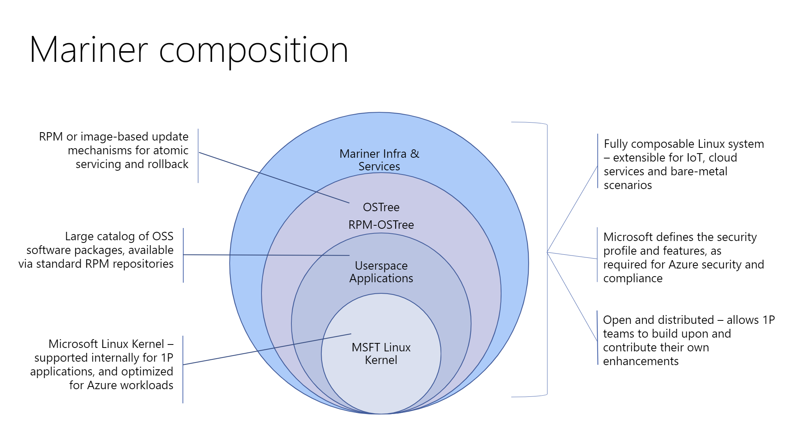
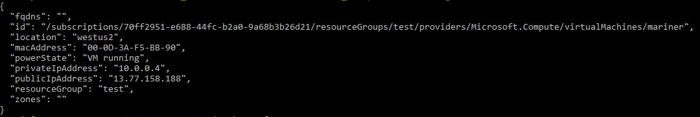
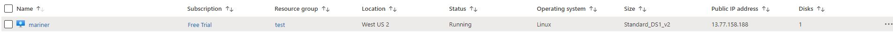

# Microsoft Mariner Linux

This is the official Mariner Linux build system. You can use this repository to
build a bootable Mariner Linux image and use it either as a standalone VM image
or as an AKS container host where you can host your Kubernetes containers. [Mariner containers should be called out as an explicit use case]

Mariner is being developed by Azure Edge & Platform to power various use cases
ranging from Azure services to powering IoT infrastructure. Mariner is the
recommended Linux distribution for use with Microsoft products. [I'm not sure if we want to say this just yet, but up to Jim]

If you have any questions about Mariner that are not answered in this
documentation, we strongly encourage you to get in touch with us at
[marinerqa@microsoft.com](mailto:marinerqa@microsoft.com)

## Who's using Mariner today?

Mariner is available to you through the Azure marketplace if you have a
subscription. Mariner is also used internally by Microsoft and several
derivative versions are in use by several teams in and around Microsoft as
well.  [should also call our the Mariner containers are available on MCR (Microsoft container registry)]

These include:

* [Azure Kubernetes Services](https://kubernetes.io/) - Production grade
  container orchestration with Mariner as an option for
  container hosting.
* [AKS HCI](https://docs.microsoft.com/en-us/azure-stack/aks-hci/) - Azure
  Kubernetes Service on Azure Stack HCI - quick way to get started hosting
  Windows and Linux containers in your data center.

Mariner adopts a customer-centric approach and we collaborate with our
customers to remove roadblocks, collect feedback and provide necessary packages
and support. To consult a professional contact
[marinerqa@microsoft.com](mailto:marinerqa@microsoft.com)

## Key Capabilities Of Mariner Linux

Mariner provides many of the traditional benefits of using Linux. In
addition to that, Mariner also provides hardened security and efficient
lifecycle management.

* **Mariner core**
	- Minimal core system that supports a variety of profiles (Azure VM or on
	  bare-metal x64 or ARM64) and allows the customer to build on top of it as
	  needed.  
* **Support & Updates**:
	- 72 hour SLA for critical vulnerabilities. 
	- Patches automatically available for the customer to update when most
	  convenient for them. 
	- `dnf` infrastructure used for upgrading packages.
* **Virtualization**
	- Mariner supports both a container host image that includes Docker and
	  Kubernetes infrastructure, as well as a container image that can be used
	  as a base image for app development.
	- Baremetal security. 
* **Efficient lifecycle management**
	- Mariner supports both RPM package and image-based update mechanisms,
	  including support for OSTree style rollbacks. Mariner is provided with an
	  "evergreen" release alongside specific security-patched stable snaps. 
	- New releases are made available annually and each release is supported
	  for 18 months. 
* **Security hardened**
	- The kernel and other aspects of the OS are built with an emphasis on
	  security and follow the secure-by-default principle, compliant with
	  Microsoft security standards and industry certifications. 
* **Federated Builds:**
	- Enables teams to innovate on top by allowing the generation and
	  maintenance of packages on top of the Mariner builds. 

# Getting Started With Mariner

[this section was a bit hard to read. More defined paragraphs or bullet points would be better]

The main CBL-Mariner repository provides detailed instructions on building
CBL-Mariner from end-to-end.

While it is possible to clone CBL-Mariner and build packages or images from
that environment, _it is not the recommended approach_ for most users. Usually,
it is better to use prebuilt versions of Mariner that are available through the
Azure store. [might want to be more clear on why it's usually better]

It is typically best to work in a smaller, problem-focused environment where
you can quickly build just what you need, and rely on the fact that the curated
CBL-Mariner packages are already available in the cloud.

In this way, you can customize an image with your preferred disk layout or the
list of packages that are included in your build. 

If you are building a product based on CBL-Mariner, the recommended approach is
for you to fork this repository and make adjustments to it that are in line
with your product needs.

The CBL-MarinerDemo repository provides you with a basic template for getting
started and from there you can create a CBL-Mariner based product (a Derivative
Image) or you can generate quick experimental debug builds to try out new
ideas.

Should you choose to build your own images, both the CBL-Mariner and
CBL-MarinerDemo repositories provide you with all the tools that you need in
order to accomplish this task.

The CBL-MarinerDemo repository also demonstrates how you can augment
CBL-Mariner without forking the CBL-Mariner repository. This can be useful if
all you are doing is building upon the default configuration and adding your
own packages to it.

The CBL-MarinerDemo repository contains the SPEC file and sources for building
a simple "Hello World" application. This repository also includes a simple
"os-subrelease" package that allows you to add identifying information about
your derivative to an /etc/os-subrelease file.

## Provisioning

You can provision Mariner in production as well as in a test environment using
a variety of options. Several deployment options are described in this and
subsequent sections. If you are just evaluating the system, then the `docker`
variant is the fastest way to run and try Mariner. For production you can also
pick one of the other options below:

* Local docker container. This option will work on Linux or Windows with
  Windows Subsystem For Linux
  ([WSL2](https://docs.microsoft.com/en-us/windows/wsl/install-win10)).
* Azure virtual machine deployment - accomplished using Asure-CLI commands
  described in detail in the Azure deployment section.
* Standard VHD Image – The core VHD image can be deployed hrough Azure Marketplace. 
* Containers – Container images can be deployed through MCR.
* AKS Container Host – Similar to the Ubuntu-AKS container host, AKS will own
  the deployment and support of the Mariner-AKS container host in the various
  clouds.
* Packages – Mariner packages are published in packages.microsoft.com

## Getting Started on WSL2 with Docker

The fastest way to try out a basic Mariner environment is by using a Mariner
Docker container. You can start this container using a single command line as
follows:

	sudo docker run -it cblmariner.azurecr.io/base/core:1.0 /bin/bash

This will download and run a basic Mariner image inside the docker container and
you can evaluate the basic rootfs and test your applications within this image.

## Getting Started on Azure 

Mariner is available to you through the Azure Marketplace. 

You can install Mariner on Azure using the az-cli utility which is available as
"azure-cli" package on Ubuntu (this also works if you are running Ubuntu under
WSL2 on Windows). 

First, install az-cli:

	tdnf install -y python3-setuptools python3-pip
	pip3 install –-upgrade pip
	pip3 install az.cli

You can start a Mariner VM using az-cli commands as follows. [The above section discusses Az-CLI as well, so this might be confusing]

First, you need to authenticate the command line interface with the azure services. To do so execute the following command and follow instructions:

	az login

Now start a Mariner VM as follows:

    az group create --name <RG> --location westus2
    az vm create --name <VMNAME> --resource-group <RG> --image /subscriptions/f9cb372a-8903-4370-9ce0-3042e3bb2cc8/resourceGroups/cblmarinerpreviewRG/providers/Microsoft.Compute/galleries/cblmarinerpreviewSIG/images/cblmarinerpreview

Once the VM has been created, it will be visible in your azure account:

You can now use `ssh` to log in to your machine and continue configuration as
you would normally configure a Linux virtual machine.

## Using Mariner With AKS

Mariner can be also used as an AKS container host. This is accomplished through
a combination of az-cli and Kubernetes services.

First, install kubectl through az-cli:

	az aks install-cli

Deploying Mariner on AKS is described in detail in the following resources:

- [Microsoft Container Service: Managed Clusters](https://docs.microsoft.com/en-us/azure/templates/microsoft.containerservice/managedclusters?tabs=json)
- [Network Policies Setup](https://kubernetes.io/docs/concepts/services-networking/network-policies/)

Below is an example of deploying AKS Mariner cluster with an ARM template:

First, create template file named `marineraksarm.yml`:

	{
	  "$schema": "https://schema.management.azure.com/schemas/2019-04-01/deploymentTemplate.json#",
	  "contentVersion": "1.0.0.1",
	  "parameters": {
		"clusterName": {
		  "type": "string",
		  "defaultValue": "marinerakscluster",
		  "metadata": {
			"description": "The name of the Managed Cluster resource."
		  }
		},
		"location": {
		  "type": "string",
		  "defaultValue": "[resourceGroup().location]",
		  "metadata": {
			"description": "The location of the Managed Cluster resource."
		  }
		},
		"dnsPrefix": {
		  "type": "string",
		  "metadata": {
			"description": "Optional DNS prefix to use with hosted Kubernetes API server FQDN."
		  }
		},
		"osDiskSizeGB": {
		  "type": "int",
		  "defaultValue": 0,
		  "minValue": 0,
		  "maxValue": 1023,
		  "metadata": {
			"description": "Disk size (in GB) to provision for each of the agent pool nodes. This value ranges from 0 to 1023. Specifying 0 will apply the default disk size for that agentVMSize."
		  }
		},
		"agentCount": {
		  "type": "int",
		  "defaultValue": 3,
		  "minValue": 1,
		  "maxValue": 50,
		  "metadata": {
			"description": "The number of nodes for the cluster."
		  }
		},
		"agentVMSize": {
		  "type": "string",
		  "defaultValue": "Standard_DS2_v2",
		  "metadata": {
			"description": "The size of the Virtual Machine."
		  }
		},
		"linuxAdminUsername": {
		  "type": "string",
		  "metadata": {
			"description": "User name for the Linux Virtual Machines."
		  }
		},
		"sshRSAPublicKey": {
		  "type": "string",
		  "metadata": {
			"description": "Configure all linux machines with the SSH RSA public key string. Your key should include three parts, for example 'ssh-rsa AAAAB...snip...UcyupgH azureuser@linuxvm'"
		  }
		},
		"osType": {
		  "type": "string",
		  "defaultValue": "Linux",
		  "allowedValues": [
			"Linux"
		  ],
		  "metadata": {
			"description": "The type of operating system."
		  }
		},
		"osSKU": {
		  "type": "string",
		  "defaultValue": "CBLMariner",
		  "allowedValues": [
			"CBLMariner",
			"Ubuntu",
		  ],
		  "metadata": {
			"description": "The Linux SKU to use."
		  }
		}
	  },
	  "resources": [
		{
		  "type": "Microsoft.ContainerService/managedClusters",
		  "apiVersion": "2021-03-01",
		  "name": "[parameters('clusterName')]",
		  "location": "[parameters('location')]",
		  "properties": {
			"dnsPrefix": "[parameters('dnsPrefix')]",
			"agentPoolProfiles": [
			  {
				"name": "agentpool",
				"mode": "System",
				"osDiskSizeGB": "[parameters('osDiskSizeGB')]",
				"count": "[parameters('agentCount')]",
				"vmSize": "[parameters('agentVMSize')]",
				"osType": "[parameters('osType')]",
				"osSKU": "[parameters('osSKU')]",
				"storageProfile": "ManagedDisks"
			  }
			],
			"linuxProfile": {
			  "adminUsername": "[parameters('linuxAdminUsername')]",
			  "ssh": {
				"publicKeys": [
				  {
					"keyData": "[parameters('sshRSAPublicKey')]"
				  }
				]
			  }
			}
		  },
		  "identity": {
			  "type": "SystemAssigned"
		  }
		}
	  ],
	  "outputs": {
		"controlPlaneFQDN": {
		  "type": "string",
		  "value": "[reference(parameters('clusterName')).fqdn]"
		}
	  }
	}

Then use az-cli to deploy the template to AKS:

	az group create --name cblmarinertestrg --location centraluseuap
	az deployment group create --resource-group cblmarinertestrg --template-file marineraksarm.yml --parameters clusterName=testcblmarinercluster dnsPrefix=cblmarineraks1 linuxAdminUsername=azureuser sshRSAPublicKey='<contents of your id_rsa.pub>'
	az aks get-credentials --resource-group cblmarinertestrg --name testcblmarinercluster
	kubectl get pods --all-namespaces

Deploying a CBLMariner cluster with az-cli requires the latest release of the aks-preview extension:

	az extension remove --name aks-preview
	az extension add --name aks-preview

Once you have the latest aks-preview extension installed you can create a CBLMariner cluster with the following commands

	az group create --name cblmarinertestrg --location centraluseuap
	az aks create --name testcblmarinercluster --resource-group cblmarinertestrg --os-sku CBLMariner --ssh-key-value <path to id_rsa.pub>
	az aks get-credentials --resource-group cblmarinertestrg --name testcblmarinercluster
	kubectl get pods --all-namespaces

You may need to restart the pods in the kube-system namespace:

	kubectl -n kube-system rollout restart deploy

# System Administration

In most cases you would not need to do any on-system administration tasks and
you should use higher level tools instead. However, if you do have a situation
where you need to manually install packages or otherwise do low level
maintenance work then you can do so by logging into the system over SSH or
through the serial console.

## Enabling Serial Console 

The serial console is useful if you want to view boot logs or have a console to
the headless VM - or for GDB debugging on the VM. You can enable the serial
console by creating a named pipe to the Hyper-V VM.

See instructions on this page:
- [Enabling Hyper-V Serial Console](https://dev.azure.com/mariner-org/mariner/_wiki/wikis/mariner.wiki/37/Enable-Hyper-V-Serial-Console).  

## Managing Services With systemd

Mariner uses `systemd` for managing all running services. This means that you
can use `systemctl` for checking status, enabling, disabling, starting and
stopping services. 

To view descriptions of all loaded and active services, run the `systemctl` command without any arguments:

	systemctl

To see all loaded, active and inactive services, supply the `--all` flag to `systemctl`:

	systemctl --all

To see all unit files and their current status run:

	systemctl list-unit-files

You can always use a combination of commands to show only certain kinds of services. For example, you can combine one of the above commands with grep:

	systemctl list-unit-files | grep network

For detailed usage instrucitons and full descriptions of all available options, check the official linux man pages for systemd utilities:

- [systemctl](https://www.man7.org/linux/man-pages/man1/systemctl.1.html)
- [systemd](https://man7.org/linux/man-pages/man1/systemd.1.html)

**Starting and stopping services**

To start or stop a service you simply provide the `start` or `stop` command to `systemctl` followed by the name of the service you want to control:

	systemctl start lighttpd
	systemctl stop lighttpd

## Inspecting System Events

Use `journalctl` to inspect important system messages from systemd. It is
useful when something goes wrong and the system is either restarted or you
simply need to review what happened. To display messages in systemd log from
when the system was started last time, use the command:

	journalctl -b

If you want to specifically list messages generated by a particular service
then you can use the following command:

	journalctl -u [service-name]

`service-name` is in this case the same name you would pass to `systemctl
[start|stop]` group of commands and it represents the name by which systemd
knows a particular service. 

To see what other options are available, run:

	man journalctl

## Installing a web server

To install apache web server run:

	dnf install apache2

> You may need to manually create `/var/logs` directory:
> `sudo mkdir -p /var/logs`

You can start and stop apache web server using the `apachectl` command (not systemctl).

	apachectl start
	apachectl stop

To check that the webserver is running do:

	sudo netstat -anl | grep :80

You also need to open port 80 on your vm. You can do this using the az-cli utility:

	az vm open-port --port 80 --name [vm-name] --resource-group [rg]

To show the public IP address of your vm, you can run this command:

	az vm show --name [vm-name] --resource-group [rg] --show-details --query [publicIps] --output tsv

## Configuring Firewall

Use the official Azure-CLI client to configure the firewall for your virtual machine. 

# Updating Mariner

The Mariner OS uses the "Tiny Dandified" (TDNF) package manager. TDNF is a C
based successor of the DNF package manager, which itself is the successor to
Fedora’s YUM package manager. TDNF is included in the base Mariner image by
default.

## Package Management Overview

When installing a package on your system, TDNF connects to one or more RPM
repositories in the cloud. If a package is unavailable in one repository, a
subsequent repository is checked. 

Repositories, and the order in which those repositories are scanned, are
specified in configuration files that reside in your Mariner image. 

The TDNF configuration file /etc/tdnf/tdnf.conf contains configuration
information about how TDNF should handle caching and other local functions. It
also contains a pointer to the repo configuration directory. Owing to its YUM
heritage, the default is to point to /etc/yum.repos.d/ which contains the list
of repo configuration files.

## RPM Repositories

By default, all Mariner images are partially configured to connect with the
curated Mariner Repository. These repositories are mariner-official-base.repo
and mariner-official-update.repo. The Base Repository always maintains a static
list of RPM's built at the time of release. 

The Update Repository always maintains a forward rolling list of Security
Patched RPM's updated over time.  We will not introduce new RPM's or
functionality here.

This repository holds all RPM's that are built from the Mariner Repository.
There are currently over 1700 packages available. Please note that this list of
packages is a "super-set" of the packages installed on the Minimal
Mariner Image. The Mariner team manages more packages than the ones installed in
the default image.

## Regular Upgrades

To upgrade all your installed packages to the latest Mariner releases run:

	sudo dnf upgrade

>If you are running this command for the first time, dnf will ask you to confirm
>GPG keys. This is fine and you can just press 'y' to continue with the upgrade.

## Available Packages

Packages that are currently available can be found here and here. [no link??]

Packages that are planning to be built can be found here under the "packages"
tab. Please make sure all filters are reset before viewing. [this is a copy paste from my eng.ms documentation and needs to be updated]

Similar packages on different distributions may have different names. If you
are looking for a particular package but can't seem to find it in this list,
please post your question in the Mariner OS support teams channel. [external customers wouldn't have access to this]

## Package Requests

You may add and build packages locally by adding them to your derivative
repository. To request a package to be included in the official build send an
email to [marinerqa@microsoft.com](mailto:marinerqa@microsoft.com)

# Getting Help

If you have any other questions about Mariner or about using Mariner in your
application, contact [marinerqa@microsoft.com](mailto:marinerqa@microsoft.com)

